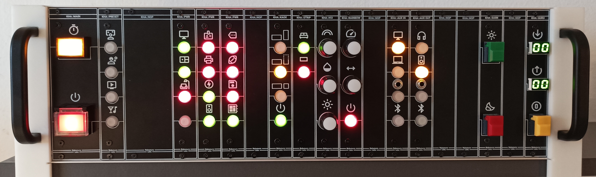
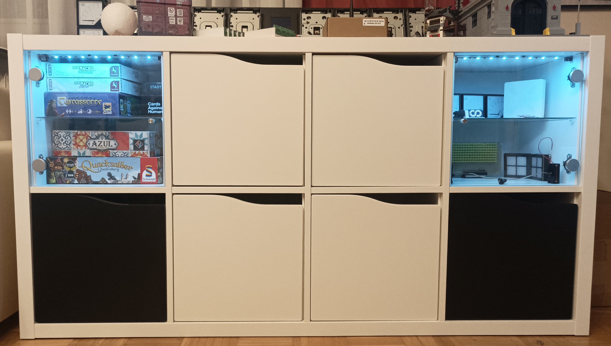
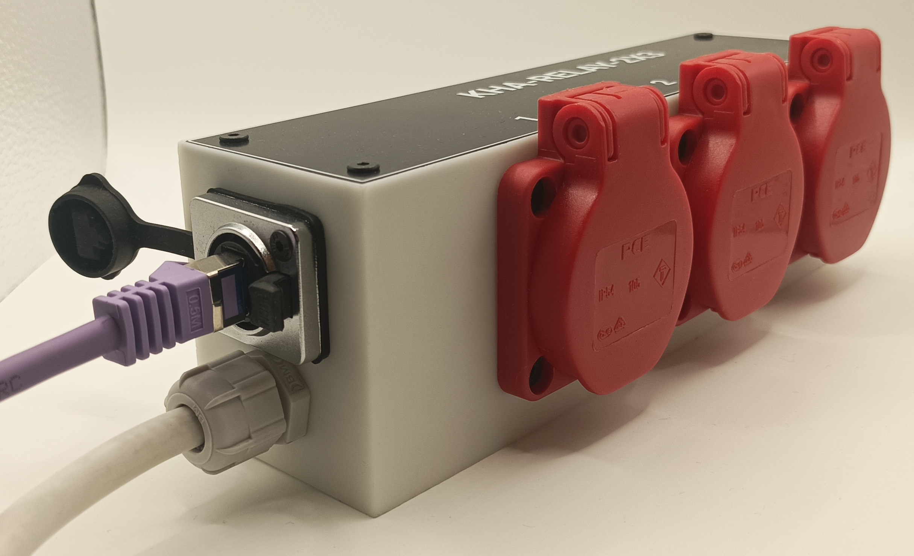

# kha

Overengineered Modular RS-485 Multi-Master 19" Subrack Home Control

## Repository

Hint: "bgt" is German for [Baugruppenträger](https://de.wikipedia.org/wiki/Baugruppentr%C3%A4ger) translating to subrack assembly

- [datasheets](datasheets/): Datasheets of used components and rack dimensions / layouts
- [kha-bgt-misc](kha-bgt-misc/): ...
- [kha-bgt-rack](kha-bgt-rack/): ...
- [kha-bgt-subrack](kha-bgt-subrack/): ...
- [kha-boot.X](kha-boot.X/): Bootloader used by all devices
- [kha-common.X](kha-common.X/): Protocol stack used by all devices
- [kha-nodes](kha-nodes/): ...
- [superseded](superseded/): Superseded ideas and failed hardware revisions
- [tools](tools/): Helper scripts to e.g. generate userrow data
- [kha-bom-collection.pdf](kha-bom-collection.pdf)/[.ods](kha-bom-collection.ods): Not exactly a Bill-of-Materials rather a collection of most components used
- [kha-protocol.pdf](kha-protocol.pdf)/[.ods](kha-protocol.ods): Protocol stack definitions

## Photos

## Misc

- All PCBs use [eAVR](https://github.com/kiu/eAVR/) as connector for AVR flashing

## Todo

- Node: Infra-red and 433Mhz remote control node
- Node: LED Strip node
- Node: LED marquee node
- Node: IrDA bridge (bridging the bus through a window)
- Stack: Combine queued TX commands into single burst?
- Stack: Merge similiar queued TX commands into single command?
- Stack: Process TX commands as incoming RX commands?

## Regrets

- Terrible collision detection / avoidance
- Buck converter capacitor generates audible noise

# License

This project is licensed under the Creative Commons Attribution-NonCommercial 3.0 Unported (CC BY-NC 3.0) license.
