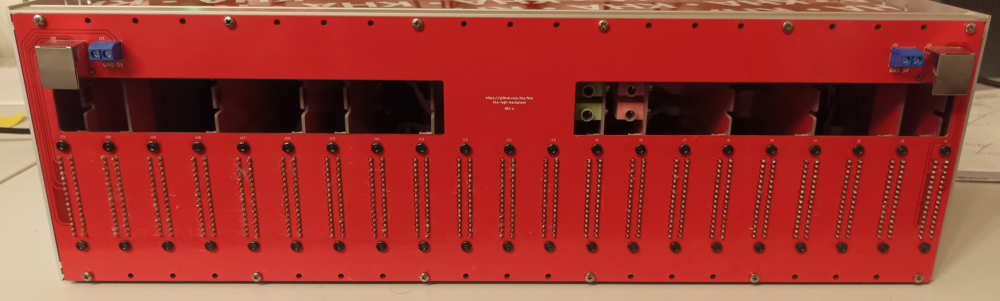
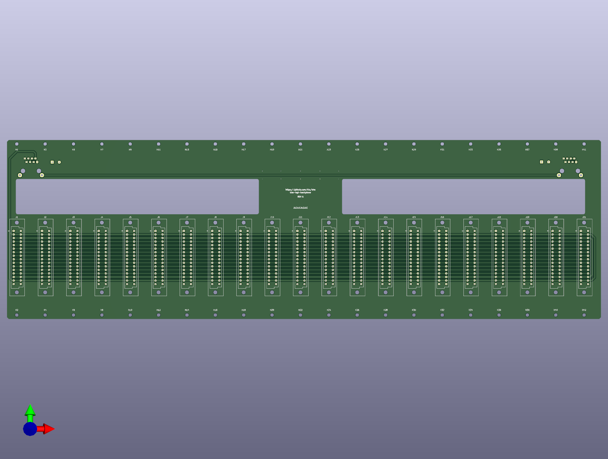
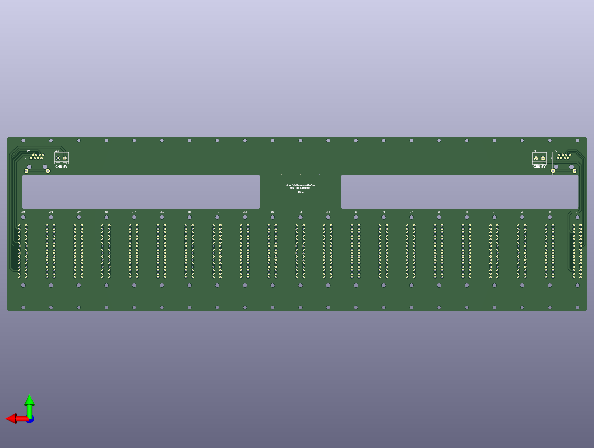

# kha-bgt-backplane

Rack backplane

## Photos

## Render

## Todo

- Remove 2nd internal RS-485 bus, never used
- Add silkscreen for bus
- Use bigger font for silkscreen
- Add screw terminal for 12V injection
- Built-in 5V stepdown on backplane
- Backplane should be symmetric
