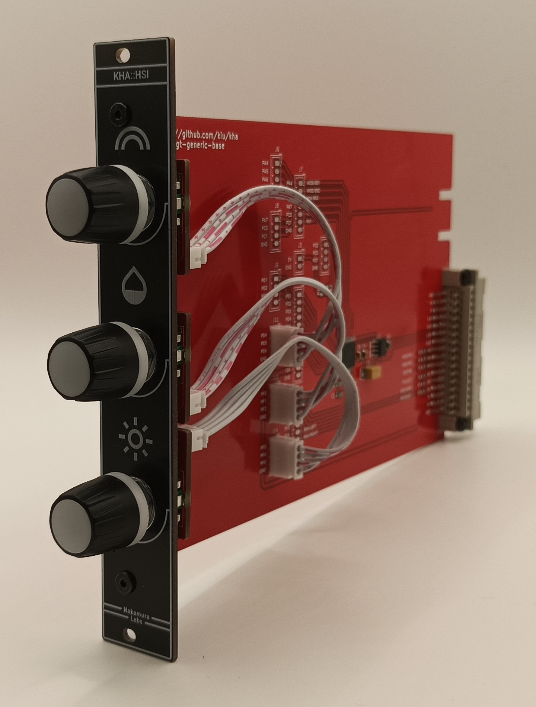

# kha-bgt-hsi

Hue Saturation Intensity Module

## Parts

Use [kha-bgt-generic-base](../../kha-bgt-misc/kha-bgt-generic-base/) as base

Use [kha-bgt-generic-rotary-encoder](../../kha-bgt-misc/kha-bgt-generic-rotary-encoder/) for encoders

## Photos

